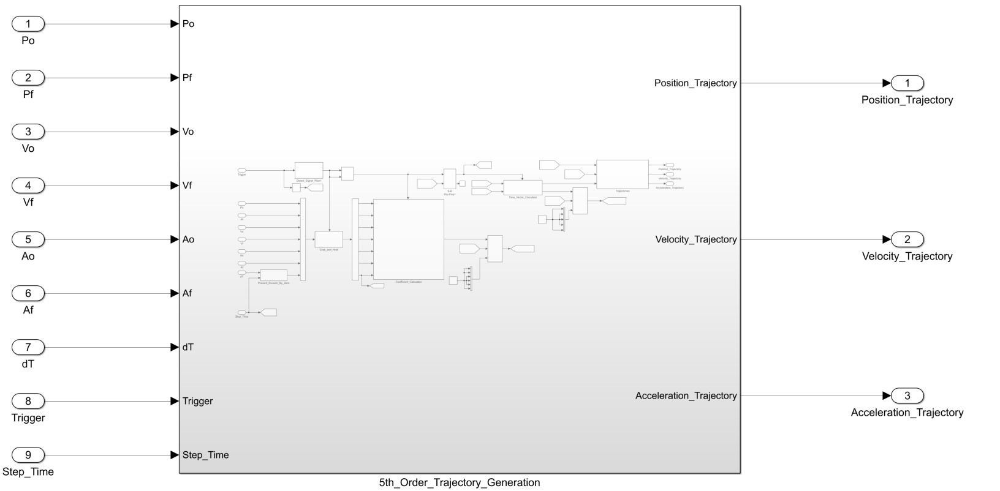
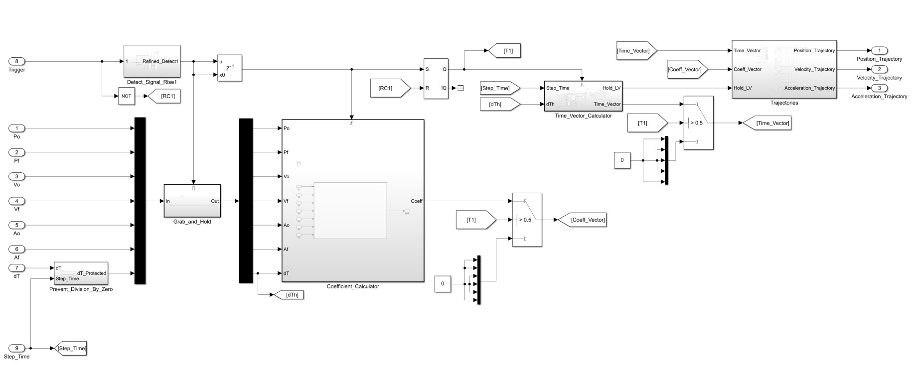
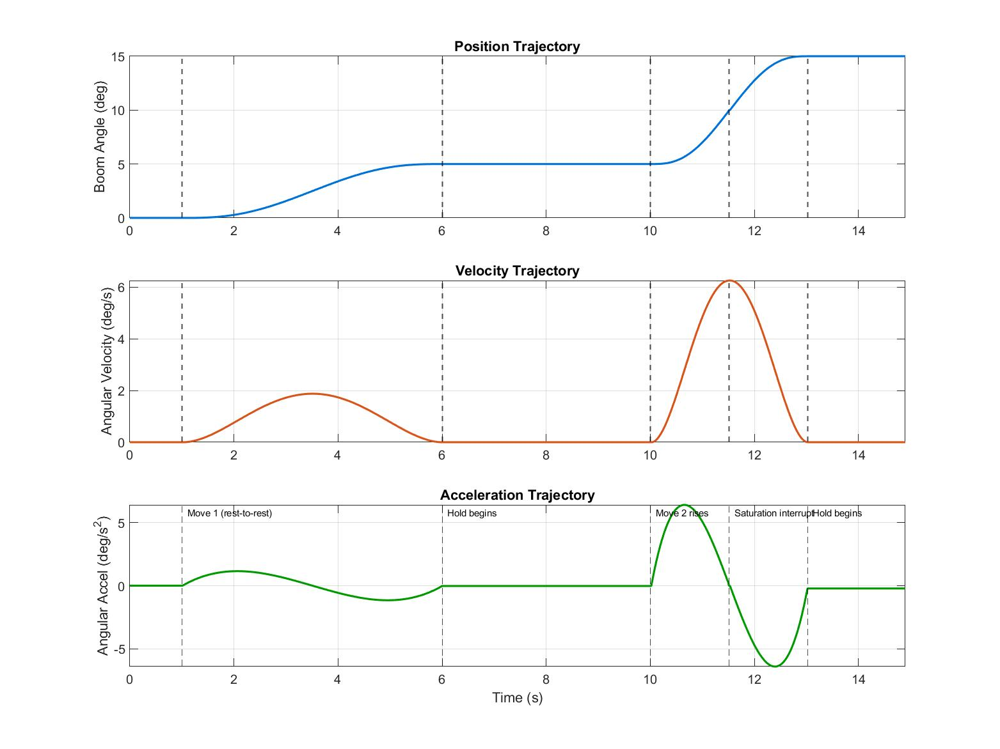
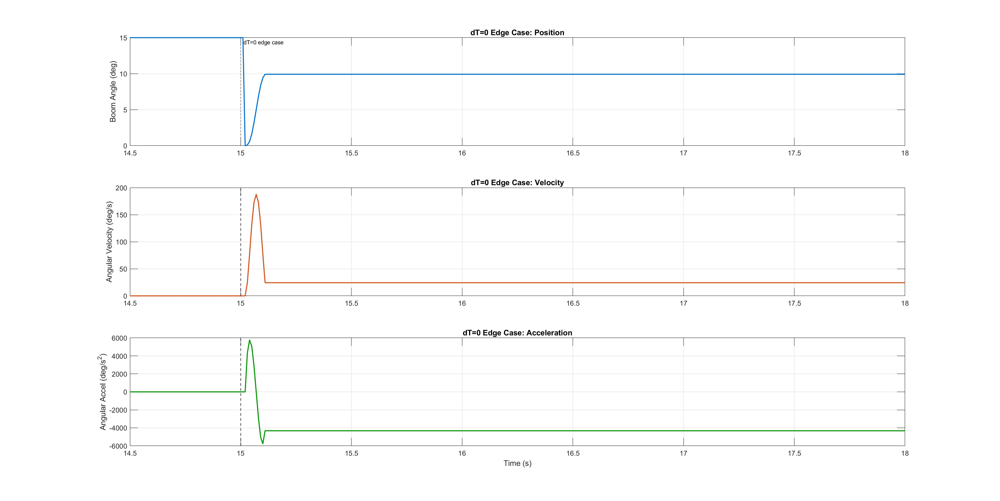

# Fifth-Order Polynomial Trajectory Generator
## https://github.com/salvatoremacchia777-boop/Embedded_Controls_Work_Portfolio
A modular Simulink block for generating smooth, closed-form quintic motion profiles from arbitrary — not necessarily rest — boundary conditions, designed for embedded real-time execution.

## Overview

Motion controllers that require path planning commonly use fifth-order (quintic) polynomials, because a quintic is the lowest-order polynomial capable of independently specifying position, velocity, *and* acceleration at both the start and end of a move. This produces smooth, continuous control effort at the actuator, which improves component longevity, reduces energy consumption, and supports cascade or full-state-feedback control architectures where each state tracks its own reference trajectory.

Conventional trajectory generators typically simplify this to the rest-to-rest case (`Vo = Vf = 0`, `Ao = Af = 0`). That simplification is convenient, but it breaks down exactly when re-planning matters most — actuator saturation, degrading tracking performance, or any disturbance that forces a new trajectory to be computed while the system is already in motion. This block is built around the opposite assumption: `Po`, `Vo`, and `Ao` are expected to come from live external signals (sensor data, an observer, or an inverse model), and `Pf`, `Vf`, `Af` are independently configurable, so a new, physically consistent trajectory can be generated from wherever the system actually is — not from an idealized rest state.

## Applications

**Heavy equipment hydraulic boom/arm control.** An excavator or loader arm is rarely starting from rest — a boom swinging toward a dig point that encounters unexpected load resistance needs to redirect smoothly mid-motion, not stop and restart. By feeding the arm's current angle, angular velocity, and angular acceleration in as live boundary conditions, this block generates a new smooth trajectory on the fly. This matters specifically for hydraulic systems, where abrupt directional changes cause pressure spikes and premature wear.

## Design Requirements and Key Choices

The design is driven by three requirements beyond generating a correct quintic:

1. **Non-rest re-planning.** All six boundary conditions (`Po, Pf, Vo, Vf, Ao, Af`) must be externally settable and independently valid — not defaulted to zero — so a trajectory can be regenerated mid-motion from the system's real state.
2. **Embedded suitability.** Coefficient computation is expensive relative to per-step evaluation, so it must run *once* per trigger event, not every timestep — and should avoid numerically expensive operations (division in particular) wherever they can be reduced.
3. **Numerical safety.** The closed-form solution requires dividing by powers of `dT`; the block must guarantee `dT` is never allowed to reach zero, regardless of what's commanded externally.

These requirements shape every subsystem described below.

## Implementation

### Mathematics

The trajectory is defined by:

$$P(t) = At^5 + Bt^4 + Ct^3 + Dt^2 + Et + F$$
$$V(t) = 5At^4 + 4Bt^3 + 3Ct^2 + 2Dt + E$$
$$Acc(t) = 20At^3 + 12Bt^2 + 6Ct + 2D$$

subject to six boundary conditions:

$$P(0)=P_o,\quad P(dT)=P_f,\quad V(0)=V_o,\quad V(dT)=V_f,\quad Acc(0)=A_o,\quad Acc(dT)=A_f$$

Six equations, six unknowns — solved here in closed form rather than via matrix inversion or Gaussian elimination. This avoids runtime matrix math entirely and keeps the per-trigger computation cheap and deterministic, which matters for an embedded target.

**Closed-form coefficients:**

$$F = P_o, \qquad E = V_o, \qquad D = \tfrac{1}{2}A_o$$

$$C = 10\,\Delta P \cdot invdT^3 - 2(2V_f+3V_o)\cdot invdT^2 + \tfrac{1}{2}(A_f-3A_o)\cdot invdT$$

$$B = -15\,\Delta P \cdot invdT^4 + (7V_f+8V_o)\cdot invdT^3 - (A_f-1.5A_o)\cdot invdT^2$$

$$A = 6\,\Delta P \cdot invdT^5 - 3(V_f+V_o)\cdot invdT^4 + \tfrac{1}{2}\Delta A \cdot invdT^3$$

where $\Delta P = P_f-P_o$, $\Delta A = A_f-A_o$, and $invdT^n = 1/dT^n$ is precomputed once via repeated multiplication (`invdT, invdT^2, ..., invdT^5`) rather than five separate divisions — division is significantly more expensive than multiplication on most embedded processors, so collapsing five divisions down to one is a meaningful runtime saving for a block that may be re-triggered frequently.

*(Full derivation available on request — omitted here for length; the closed-form result above has been verified both symbolically and numerically against the boundary conditions.)*

### Block Architecture

| Subsystem | Function |
|---|---|
| **Detect_Signal_Rise** | Detects the rising edge of `Trigger`. Drives an SR flip-flop (set on rising edge, reset when `Trigger` is false) that gates the rest of the block. |
| **Grab_and_Hold** | Latches `Po, Pf, Vo, Vf, Ao, Af, dT_Protected` at the trigger's rising edge. Any change to these raw inputs while `Trigger` remains high has no effect on the active trajectory — this is what gives the block its stability/continuity guarantee. |
| **Coefficient_Calculator** | A MATLAB Function block (`solve_quintic`) that runs for exactly one timestep per rising edge, computing the six coefficients above and outputting them as a vector. |
| **Time_Vector_Calculator** | A discrete integer accumulator, scaled by `Step_Time` to produce a running timer. Counting in integers rather than accumulating decimal time reduces drift. Resets to zero when the block is disabled or when `Time >= dTh`; on reaching `dTh` it latches a `Hold_Time` flag via a second SR flip-flop. Outputs `[T, T², T³, T⁴, T⁵]` and a `Hold_LV` flag. |
| **Trajectories** | Evaluates position, velocity, and acceleration from the coefficient and time-power vectors; once `Hold_LV` is true, holds the last computed value for each output rather than continuing to evaluate. |
| **Prevent_Division_By_Zero** | Produces `dT_Protected = max(dT, 10×Step_Time)`, guaranteeing the coefficient solve never divides by zero. See **Results** below for a more rigorous, hardware-derived alternative floor. |

**Inputs:** `Po, Pf, Vo, Vf, Ao, Af, dT, Trigger, Step_Time`
**Outputs:** `Position_Trajectory, Velocity_Trajectory, Acceleration_Trajectory`

*Figure 1: Block exterior — inputs and outputs.*

*Figure 2: Internal subsystem wiring, corresponding to the table above.*

## Verification & Validation

The block was tested against a schedule exercising five requirements, using units representative of a hydraulic mining shovel boom (degrees, deg/s, deg/s²):

1. Coefficients are computed exactly once per `Trigger` rising edge
2. The active trajectory is unaffected by input changes while `Trigger` remains high
3. `dT_Protected` prevents division-by-zero when `dT` is commanded to 0
4. A new trajectory can be triggered mid-flight (saturation/re-plan), starting from the block's actual current, non-rest state
5. The block correctly holds its final values once a trajectory's `dT` has elapsed

**Test schedule:**

| Phase | Global time | Trigger | Po, Vo, Ao | Pf, Vf, Af | dT | Peak accel |
|---|---|---|---|---|---|---|
| Idle | 0 – 1s | 0 | — | — | 5 | — |
| Move 1 (rest-to-rest) | 1s rising edge | 1 | 0°, 0, 0 | 5°, 0, 0 | 5 | 1.15 deg/s² |
| Jitter | 2 – 2.3s | 1 (held) | inputs wiggle | inputs wiggle | — | — |
| Hold (= Move 1 duration) | 6 – 10s | 1 | — | — | — | — |
| Move 2 (rest start) | 10.01s rising edge | 0→1 | 5°, 0, 0 | 15°, 0, 0 | 3 | 6.41 deg/s² |
| Saturation interrupt | 11.51s (1-step drop) | 0→1 | 10.0°, 6.25, 0 *(Move 2's real state, exactly halfway)* | 15°, 0, 0 *(same target)* | 1.5 | 6.41 deg/s² |
| Hold | 13.02 – 15s | 1 | — | — | — | — |
| dT=0 edge case | 15.01s rising edge | 0→1 | 0°, 0, 0 | 10°, 0, 0 | 0 | n/a (protection test) |
| Sim end | 18s | — | — | — | — | — |

All handoff values in the saturation-interrupt case are the block's own measured output at the moment of interruption, not arbitrary test numbers — confirming the block genuinely re-plans from wherever it actually is, not from a designed rest condition. Verification was performed via an independent, second implementation of the closed-form coefficient solve (used only for cross-checking, not called from the block itself), evaluated against the same schedule and compared to the logged output.

*Figure 3: Position, velocity, and acceleration through the working phases of the test schedule (t=0–14.9s), showing Move 1, the jitter-immunity window, the hold, Move 2, and the mid-flight saturation interrupt. Phase transitions are labeled directly on the plot. The dT=0 edge case is deliberately excluded from this figure and shown separately below, since its acceleration/velocity magnitudes are roughly two orders of magnitude larger and would otherwise compress this entire plot into an unreadable near-zero line.*

## Results

The block correctly regenerates a trajectory whenever `Trigger` disengages and re-engages, and the active motion profile is fully immune to drift or noise on the external driving signals while `Trigger` remains high.

The current `dT_Protected = max(dT, 10×Step_Time)` reliably prevents division-by-zero, but does not bound peak acceleration — a `dT` commanded far below what the physical system could realistically execute still produces a correspondingly large velocity/acceleration spike in the output, shown below for the dT=0 edge case from the test schedule:

*Figure 4: The dT=0 edge case in isolation, at its own natural scale. `dT_Protected` correctly prevents division-by-zero — no NaN/Inf, the trajectory completes and holds — but the resulting velocity (~190 deg/s) and acceleration (~±6000 deg/s²) magnitudes illustrate why this floor is not sufficient on its own for a real hardware deployment; see the derivation below.*

For an application-specific deployment, a more rigorous floor can be derived directly from actuator hardware limits:

$$dT_{min} = \frac{V_{max}-V_{min}}{A_{max}}$$

derived from $A = dV/dT \Rightarrow dT = dV/A$, using the actuator's full velocity range ($dV_{peak} = V_{max}-V_{min}$) and its maximum acceleration magnitude. This is the bang-bang (constant-maximum-acceleration) minimum-time bound — provably the fastest physically possible transition across the actuator's velocity range under a hard acceleration cap, not a heuristic. If the actuator's acceleration and deceleration limits are asymmetric, use the smaller (more restrictive) of the two magnitudes for $A_{max}$, so the floor remains valid regardless of which direction a given move requires.

This floor was derived and verified independently but has not yet been integrated into the block or re-validated against the test schedule above; the existing schedule's Move 2/Move 3 durations are shorter than this floor would allow and would need to be re-tuned first. Noted here as a scoped next step, not a defect in the current implementation.

## Conclusion

This block provides a closed-form, embedded-suitable quintic trajectory generator that supports live re-planning from arbitrary, non-rest boundary conditions — the case most conventional generators simplify away. Reasons to use it:

- **Embedded-optimized**: closed-form coefficient solve, computed once per trigger period rather than every timestep, with division count minimized via precomputed reciprocals.
- **Drift-resistant**: the internal timer is a discrete integer accumulator that zeroes after each completed motion, rather than an unbounded continuously-accumulating decimal timer.
- **General-purpose**: outputs position, velocity, and acceleration references suitable for direct reference tracking, cascade control, or full-state feedback.
- **Model-agnostic**: nothing in the block is specific to motion control — it applies equally to temperature, flow, or any other scalar reference-tracking problem needing a smooth, re-plannable trajectory.

## Files

1. 5th_Order_Polynomial_Engineer_Peer_Review_ReadME.md
2. 5th_Order_Polynomial_Block_Diagram.jpg
3. 5th_Order_Polynomial_Results1.jpg
4. 5th_Order_Polynomial_Results2.jpg
5. 5th_Order_Polynomial_Top_Level_Block_Diagram.jpg
6. Fifth_Order_Polynomial.slx
7. Fifth_Order_Polynomial_Test_Harness.slx
8. Fifth_Order_Trajectory_Schedule.m
9. Fifth_Order_Trajectory_Verification.m
10. Fifth_Order_Polynomial.c
11. Fifth_Order_Polynomial.h
