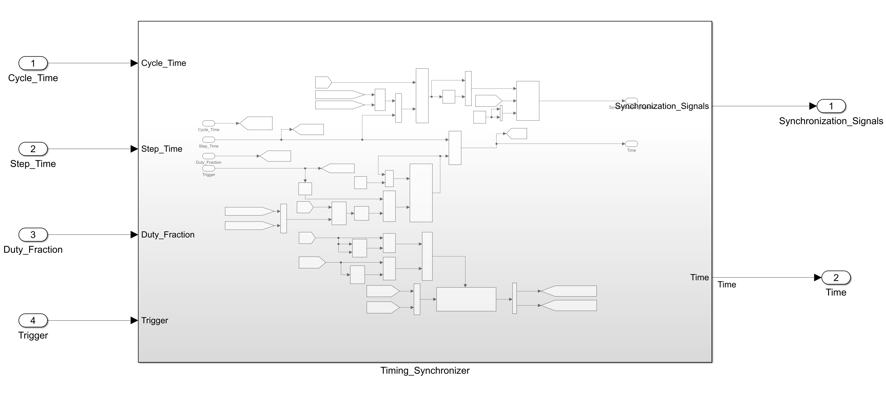
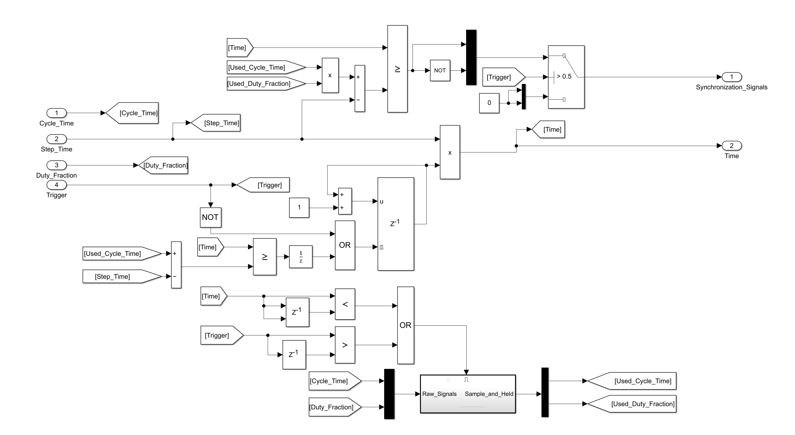
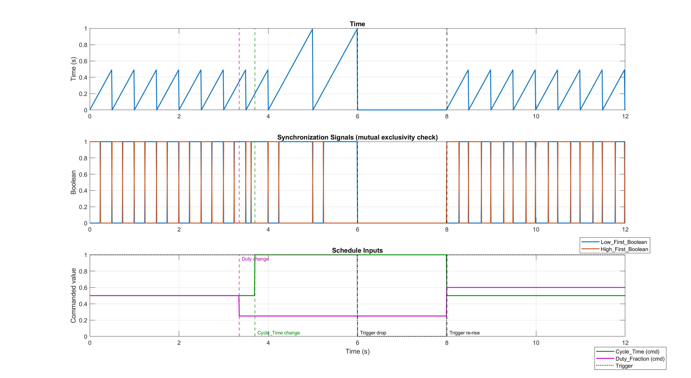

**Timing Synchronizer**

*Purpose: Modular Block that can be used when particular events are periodic and out of phase with one another.* 

***Applications:***

*Hydraulic actuator life-cycle testing. A common reliability test runs a cylinder through repeated extend/retract cycles to validate seal life and cycle-count ratings before a product ships. This block maps directly onto that setup: Low\_First\_Boolean/High\_First\_Boolean command the extend and retract solenoids on a directional control valve, Duty\_Fraction sets an asymmetric dwell (e.g. a longer loaded extend stroke, a shorter unloaded retract), Cycle\_Time sets the test rate, and Trigger allows the test to be paused mid-run — for an inspection, an out-of-spec reading, or an e-stop — and resumed later without corrupting the schedule already in progress.*

*Other applicable use cases:*

*Motor intermittent-duty scheduling (e.g. IEC S3-style run/rest cycling to stay within thermal limits)*

*Lead/lag alternation between two redundant actuators or pumps, to balance runtime and wear*

*Any two-phase repeating process — sampling vs. settling, active vs. cooldown — that needs to run on a shared, resettable, pausable schedule without a dedicated hardware timer*

***About the Block:*** 

**Inputs**

* *Cycle\_Time (Time of one complete periodic cycle) || (Should be a multiple of Step\_Time)*
* *Step\_Time (Time step for the solver or algorithm)*
* *Duty\_Fraction (Percentage or Number between 0-1, creates duty cycle) One signal is high for X percentage the other is high for Y percentage X+Y = Cycle\_Time)*
* *Trigger (Boolean Signal that permits the logic to run.*

**Outputs**

* *Synchronization Signals*

  * *1) Boolean that is high for Duty\_Fraction\*Cycle\_Time*
  * *2) Boolean that is low for (1-Duty\_Fraction)\*Cycle\_Time*
  * *3) Time Signal (Resettable Counter)*

*Internal Logic*

* *Resettable Timer*

  * *Discrete Accumulator* 

    * *Counter = In(T)+In(T-1)*
    * *Time = Counter\*Step\_Time;*
    * *In(T-1) is a unit delay block* with an initial condition of 0. 
    * Reset Logic

      * Condition 1: Trigger is NOT True.
      * Condition 2: Time >= Cycle Time 
      * Condition 3: Condition 1 or Condition 2
      * Reset into discrete accumulator is a level hold which means it keeps the accumulator at its initial condition until Condition 3 is false.
* Creating the Synchronization Signals

  * Desired\_On\_Time = Cycle\_Time\*Duty\_Fraction; % Desired time for Boolean to be high.
  * Desired\_Adjusted\_Time = On\_Time-Step\_Time; % Removes the one sample delay from discrete accumulator.
  * On\_Signal = Time >= Actual\_Time;
  * Off\_Signal = Not(On\_Signal);
  * Use Mux block to create a vector \[On Signal;Off Signal]
  * Switching Signal(Ensures the Synchronization Signals are zero when the trigger is zero)

    * if Trigger >.5

      * Output = \[On Signal;Off Signal]
    * else

      * Output = \[0;0]

Synchronization\_Signal = Output

\*\* Latest Modifications\*\*

Time Varying Duty\_Fraction and Cycle Time signals are sampled and held when Current\_Time < Previous\_Time or when the trigger rises. This ensures that the algorithm maintains continuous signals and yet allows for dynamic changing of Duty\_Fraction and Cycle Time.

How it works:

Set Condition = Current\_Time < Previous\_Time or Current\_Trigger > Previous\_Trigger

When Set Condition = 1

&#x09;Enable Subsystem

&#x09;	Subsystem grabs and hold the previous value up until the block reenables.

Output = demux\[Used\_Cycle\_Time;Used\_Duty\_Fraction]

Now the signals Used\_Cycle\_Time and Used\_Duty\_Fraction are used internally by the algorithm. 

Reset on the accumulator is done when Time >= Cycle-Time-Step\_Time since the accumulator does not see the reset as its delayed one time step due to the algebraic loop.

## System Architecture & Verification

### Top-Level Block Diagram

### Internal Block Diagram

\*\* Test Harness:

Requirements:

1\) Time resets exactly every Cycle\_Time seconds (steady state)

2\) A live Cycle\_Time change takes effect only at the NEXT reset boundary, not immediately

3\) A live Duty\_Fraction change takes effect only at the NEXT reset boundary, not immediately

4\) After a Trigger drop and re-rise, the block re-latches correctly (no stale values carried over from before the drop)

5\) Low\_First\_Boolean and High\_First\_Boolean are always mutually exclusive while Trigger is high, and both are 0 while Trigger is low

Verification is done "black box" -- only top-level, externally

observable signals are used (Time, Cycle\_Time, Duty\_Fraction, Trigger,

Low\_First\_Boolean, High\_First\_Boolean). No internal block signals are

referenced, so this proves correct behavior from the outside, the same

way any user of the block would observe it.

Note on the expected on-fraction formula (requirements 3 and 4):

Time is a discrete counter, so any "Time >= Threshold" comparison

resolves one sample late -- the counter can only cross a threshold at

its next scheduled increment, never exactly on it. The block corrects

for this by subtracting one Step\_Time from the on/off-duration

threshold, so the expected on-time is (Duty\_Fraction \* Cycle\_Time) - Step\_Time, not the raw product.

### Simulation & Verification Results

Files Included:

1. Timing\_Synchronizer.slx --> Library style subsystem block with all inputs and outputs external to block.
2. Timing\_Synchronizer\_Test\_Harness.slx --> Used to test against requirements
3. Timing\_Synchronizer\_Schedule.m --> Defines parameters for Test Harness test.
4. Timing\_Synchronizer\_Verification.m --> runs Timing\_Synchronizer\_Test\_Harness.slx and presents results.
5. Timing\_Synchronizer\_Results.jpg --> Picture of results.
6. Timing\_Synchronizer\_README.md
7. Timing_Synchronizer.c
8. Timing_Synchronizer.h
9. Timing_Synchronizer_Block_Diagram.jpg
10. Timing_Synchronizer_Top_Level_Block_Diagram.jpg

\*\* Note: All Simulink diagrams, logic, and implementation are original work. m-files were created by instructing Claude AI on what type of plots to generate.

